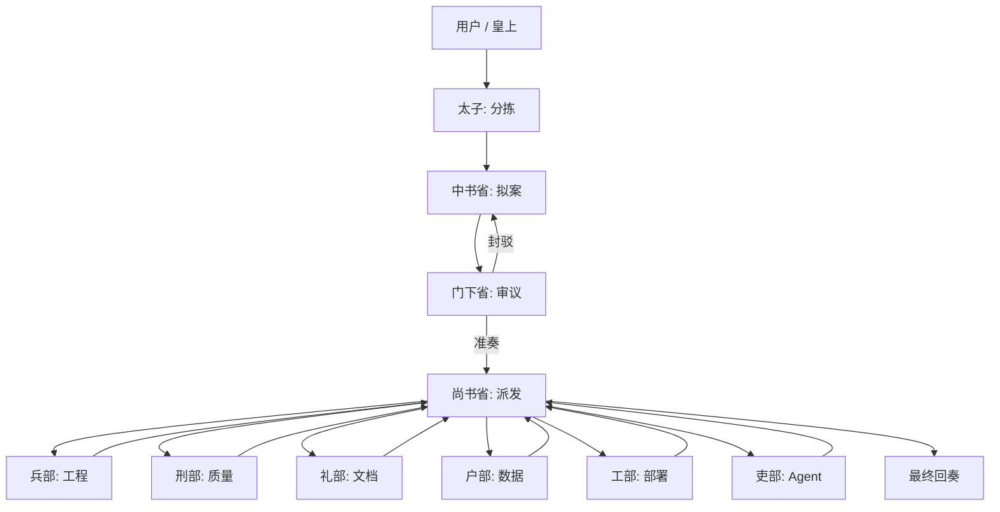
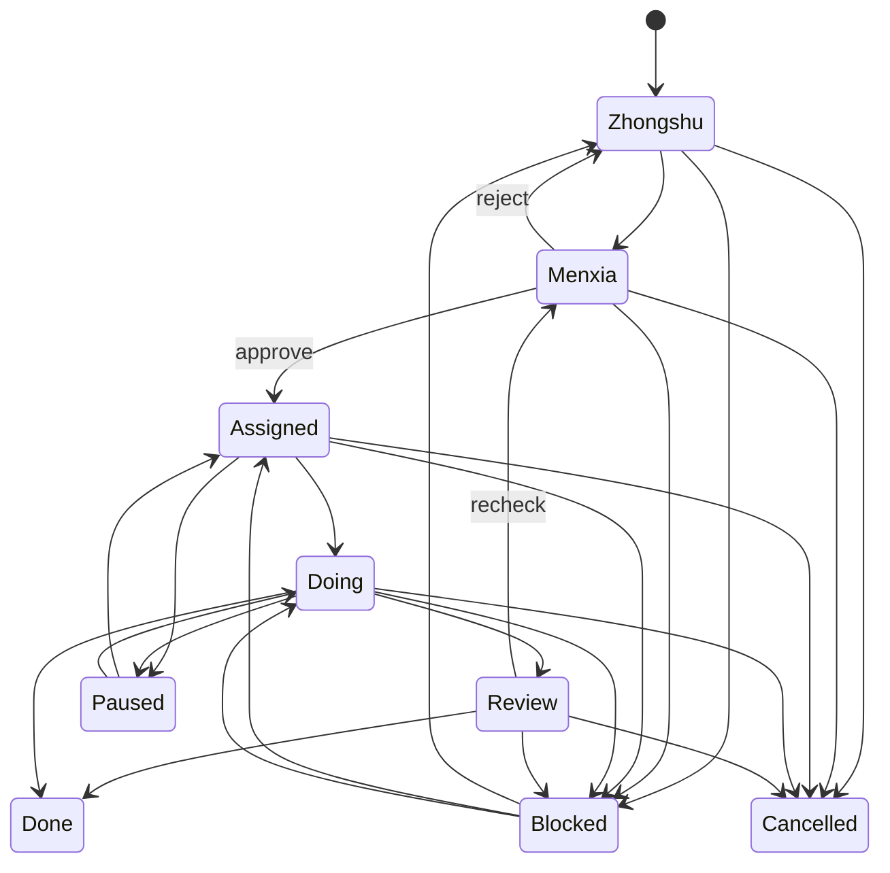

# Architecture

Agent-Team 是一个轻量控制平面。它不强行替代 Codex 或 Claude Code 的执行环境，而是为它们提供一套稳定的任务制度、角色边界和审计账本。

## Components



## Layers

- **Role layer**: `agents/` and `.claude/agents/` define responsibilities.
- **Control layer**: `config/state-machine.json` and `config/court.json` define legal movement and routing.
- **Ledger layer**: `scripts/sansheng.py` records tasks in `data/tasks.json` and append-only events in `data/events.jsonl`.
- **Output layer**: `report` renders a final memorial that can be pasted into Codex, Claude Code, GitHub, Notion, or release notes.

## State Machine



## Event Shape

Every CLI command appends JSONL:

```json
{
  "event_id": "uuid",
  "at": "2026-06-25T07:00:00Z",
  "type": "task.dispatch",
  "task_id": "JJC-20260625-001",
  "actor": "shangshu",
  "payload": {
    "department": "bingbu",
    "title": "实现核心 CLI"
  }
}
```

This makes the system replayable without a service dependency.

## Extension Points

- Replace `data/tasks.json` with SQLite or Postgres.
- Mirror task states to GitHub Issues.
- Render JSONL events into a web Kanban board.
- Add real parallel subagent execution where the host supports it.
- Add model-specific prompt packs under `.codex/prompts` or `.claude/agents`.

