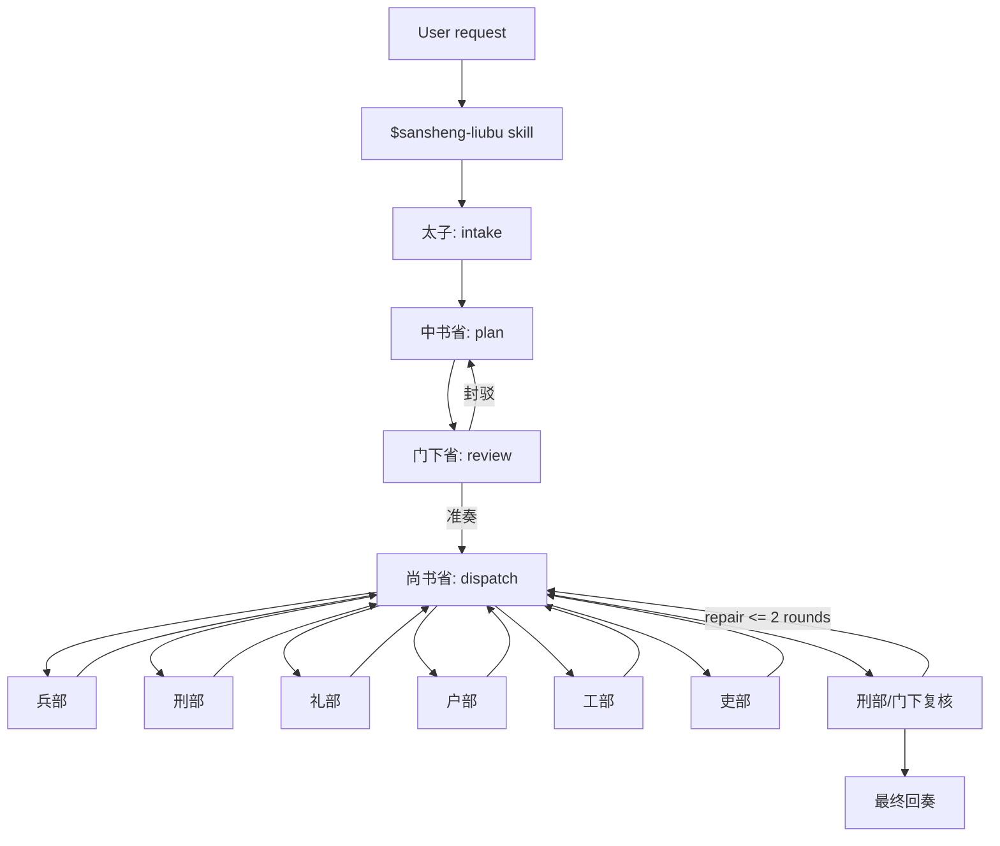

# Skill Architecture

Agent-Team is now a skill-first system. The canonical workflow is stored in `skills/sansheng-liubu/`, and host-specific adapters stay thin.

## Single Source of Truth

- `skills/sansheng-liubu/SKILL.md`: trigger metadata and core workflow.
- `skills/sansheng-liubu/references/`: detailed contracts loaded only when needed.
- `.claude/commands/sansheng.md`: alias that invokes the skill.
- `.claude/agents/*.md`: role adapters that stay within one office or ministry.

## Non-Goals

- No required service.
- No required database.
- No required Python control plane.
- No hidden infinite review loop.

